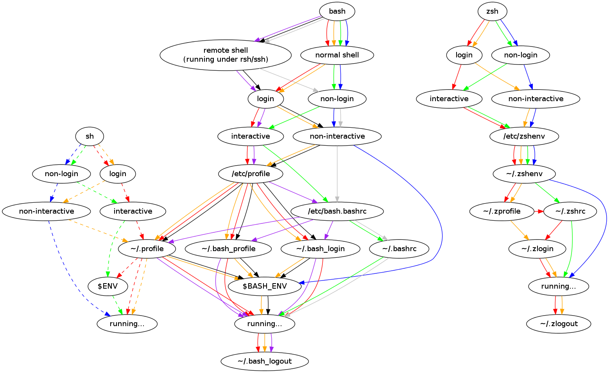

# ZSH

- [ ] TODO: plugins and customizations
  - antidote
  - powerlevel10k

## Installation

> [!NOTE]
>
> It is better to use the system native C toolchain to compile zsh from sources. Otherwise, the shell may be hanging in certain scenarios. E.g. with Clang 18 on Ubuntu a test was failing by just hanging the shell. With GCC on the same system everything worked fine.

[Download source distribution of zsh][zsh-download], unpack it, and open the terminal in the directory.

Alternatively, you can clone the sources:

```shell
git clone git://git.code.sf.net/p/zsh/code zsh
cd ./zsh
git checkout "${ZSH_VERSION}"
```

Install the build dependencies:

```shell
sudo apt update -y
sudo apt install -y \
  yodl \
  perl \
  info texinfo texinfo-lib install-info
```

> [!NOTE]
> If you checked the repo from git run `./Util/preconfig`. Otherwise, skip it.
>
> ```shell
> ./Util/preconfig
> ```

Configure the build:

```shell
mkdir ./build
../configure --enable-cflags="-O2"
```

Build and test:

```shell
make
make check
```

> [!NOTE]
>
> If something goes wrong with the build, run `make distclean` to remove everything that the `./configure` script generated.

After the build and tests successful completion, intsall zsh:

```shell
sudo make install
sudo make install.info
```

### Source `/etc/profile` from `/etc/zsh/zprofile`

> [!IMPORTANT]
>
> [`/etc/profile` file should be sourced by all POSIX sh-compatible shells upon login][arch-wiki-startup-shutdown-files].

```shell
sudo mkdir -p /etc/zsh
sudo echo ". /etc/profile" | sudo tee -a /etc/zsh/zprofile
```

### Set zsh as a default login shell

Ensure `zsh` is present in `/etc/shells`:

```shell
ZSH_PATH="$(which zsh)"; [[ -z "$(cat /etc/shells | grep "${ZSH_PATH}")" ]] && (echo "${ZSH_PATH}" | sudo tee -a /etc/shells) || echo "${ZSH_PATH} is already present in /etc/shells"
```

Set zsh as [default login shell][arch-wiki-change-default-shell]:

> [!NOTE]
>
> As per default PAM configuration, ensure that the shell you run this command from is listed in `/etc/shells`.

```shell
sudo chsh -s "$(which zsh)" "${USER}"
```

## Configuration

Setup config from this repo on your system:

```shell
./setup-config.sh
```

For a reference, see the [description of startup and shutdown files for zsh][arch-wiki-startup-shutdown-files]. Visally it looks as follows:



- [ ] TODO
  - Select back with shift tab

### `antidote` plugin manager

#### [`antidote` installation][antidote-installation]

Clone the `antidote` sources:

```shell
git clone https://github.com/mattmc3/antidote.git ~/.antidote
cd ~/.antidote
git checkout "${ANTIDOTE_VERSION}"
```

Add the following to `.zshrc` (already present in this config):

```shell
## Antidote
### https://getantidote.github.io/install

ANTIDOTE_PATH="${HOME}/.antidote"

# Set the root name of the plugins files (.txt and .zsh) antidote will use.
zsh_plugins_txt="${ZDOTDIR:-~}/.zsh_plugins.txt"
zsh_plugins_zsh="${XDG_STATE_HOME}/.zsh_plugins.zsh"

# Ensure the .zsh_plugins.txt file exists so you can add plugins.
[[ -f "${zsh_plugins_txt}" ]] || touch "${zsh_plugins_txt}"

# Lazy-load antidote from its functions directory.
fpath=("${ANTIDOTE_PATH}/functions" ${fpath})
autoload -Uz antidote

# Generate a new static file whenever .zsh_plugins.txt is updated.
if [[ ! "${zsh_plugins_zsh}" -nt "${zsh_plugins_txt}" ]]; then
  antidote bundle <"${zsh_plugins_txt}" >|"${zsh_plugins_zsh}"
fi

# Source your static plugins file.
source "${zsh_plugins_zsh}"
```

### Prompt

#### Starship

Install [`../starship/README.md`](../starship/README.md) following the instructions.

Once you [installed starship on your system](../starship/README.md#installation), export its initialization code to a file that you will load from your `.zshrc`:

```shell
starship init "${SHELL##*/}" > "${ZSH_CUSTOM_PLUGINS_DIR}/starship_init"
```

This guide recommends that your rerun this command and overwrite the existing init file every time you update starship.

Then, make sure your `.zshrc` contains the the following configuration:

```shell
. "${ZSH_CUSTOM_PLUGINS_DIR}/starship_init"
```

### Plugins

- [ ] TODO
  - [x] zsh-vim-mode
  - [ ] zsh-syntax-highlighting
  - [ ] [zsh-completions](https://github.com/zsh-users/zsh-completions/tree/master)
  - [ ] [rust-zsh-completions](https://github.com/ryutok/rust-zsh-completions)
  - [ ] zsh-autosuggestions
  - [ ] git
  - [ ] sudo
  - [ ] kubectl
  - [ ] kubectx
  - [ ] history-substring-search

Install new plugins with [`antidote`](#antidote-plugin-manager) (see the full list of [options][antidote-options]):

```shell
antidote install <plugin-url> [options]
```

`antidote` will add the given plugin to the [`./config/zsh/.zsh_plugins.txt`](./config/zsh/.zsh_plugins.txt) file.

#### `zsh-vi-mode`

[Configuration docs][github-zsh-vi-mode].

### Integrations

- [ ] TODO
  - `fzf` for history search and suggestions
    - Install plugin `fzf-tab`
      - ```shell
        zstyle ':completion:*' menu no
        zstyle ':fzf-tab:complete:cd:*' fzf-preview 'ls --color "${realpath}"'
        ```

## Useful links

- [arch-wiki-change-default-shell][arch-wiki-change-default-shell]
- [arch-wiki-startup-shutdown-files][arch-wiki-startup-shutdown-files]
- [zsh-org][zsh-org]
  - [zsh-download][zsh-download]
  - Docs
    - [zsh-intro-doc][zsh-intro-doc]
    - [zsh-faq][zsh-faq]
    - [zsh-manual-toc][zsh-manual-toc]
      - [zsh-options][zsh-options]
    - [zsh-user-guide-toc][zsh-user-guide-toc]
- [youtube-zsh-dream-of-autonomy][youtube-zsh-dream-of-autonomy]
- [antidote-installation][antidote-installation]
- [antidote-options][antidote-options]
- [github-zsh-vi-mode][github-zsh-vi-mode]

[arch-wiki-change-default-shell]: <https://wiki.archlinux.org/title/Command-line_shell#Changing_your_default_shell>
[arch-wiki-startup-shutdown-files]: <https://wiki.archlinux.org/title/Zsh#Startup/Shutdown_files>
[zsh-org]: <https://www.zsh.org/>
[zsh-download]: <https://zsh.sourceforge.io/Arc/source.html>
[zsh-intro-doc]: <https://zsh.sourceforge.io/Intro/intro_toc.html>
[zsh-faq]: <https://zsh.sourceforge.io/FAQ/>
[zsh-manual-toc]: <https://zsh.sourceforge.io/Doc/Release/zsh_toc.html>
[zsh-options]: <https://zsh.sourceforge.io/Doc/Release/Options.html>
[zsh-user-guide-toc]: <https://zsh.sourceforge.io/Guide/zshguide.html>
[youtube-zsh-dream-of-autonomy]: <https://www.youtube.com/watch?v=ud7YxC33Z3w>
[antidote-installation]: <https://getantidote.github.io/install>
[antidote-options]: <https://getantidote.github.io/options>
[github-zsh-vi-mode]: <https://github.com/jeffreytse/zsh-vi-mode>
